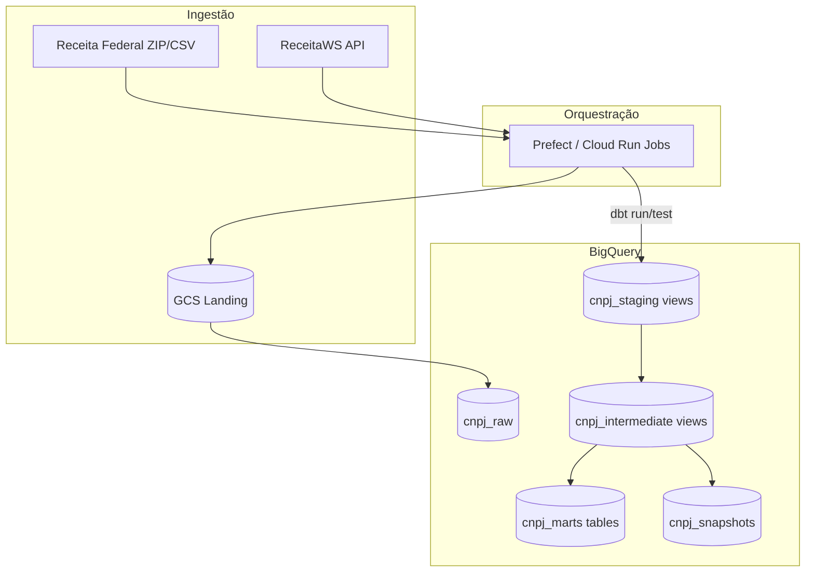

# FinOps e Otimização - CNPJ Lakehouse no Google BigQuery

Proposta de implantação do pipeline CNPJ (dbt + Prefect, hoje em DuckDB local) em **Google BigQuery**, com foco em custo, performance e onboarding de novos colaboradores.

**Repositório do projeto:** https://github.com/dwsilva/cnpj-lakehouse-challenge  
**Ambiente local de referência:** Docker (`docker compose run --rm pipeline`)

---

## 1. Contexto e objetivos

O mesmo código dbt deste repositório troca o adapter `dbt-duckdb` por `dbt-bigquery`. Objetivos:

1. Minimizar **bytes scanned** (partition pruning + clustering)
2. Separar batch noturno de consultas interativas de BI
3. Evitar full refresh com **incremental** e **snapshots SCD2**
4. Guardrails: `require_partition_filter`, quotas, alertas de billing

| Fonte | Volume estimado (produção) | Frequência |
|-------|---------------------------|------------|
| Receita Federal (ZIP/CSV) | ~50–80 GB compactado / mês | Mensal |
| ReceitaWS (API REST) | KB por CNPJ | Amostra / sob demanda |
| dbt marts | ~5–15 GB (fato + dims) | Diário / após carga RF |

---

## 2. Arquitetura proposta no GCP



| Componente | Serviço | Por quê |
|------------|---------|---------|
| Landing | Cloud Storage (Nearline) | ZIPs mensais baratos |
| Warehouse | BigQuery | Columnar, serverless, dbt nativo |
| Orquestração | Prefect + Cloud Run Jobs | Mesmo Docker deste desafio |
| Secrets | Secret Manager | ReceitaWS, SA keys |
| CI | GitHub Actions (já no repo) | `dbt test` em PR |
| FinOps ops | Billing alerts + `maximum_bytes_billed` | Teto por query de BI |

---

## 3. Mapeamento DuckDB → BigQuery

| Local | BigQuery | Materialização |
|-------|----------|----------------|
| `raw.raw_*` | `cnpj_raw.*` | Tabela, partition ingestion-time |
| `raw.receitaws_enrichment` | `cnpj_raw.receitaws_enrichment` | JSON nativo |
| `staging.stg_*` / `intermediate.int_*` | datasets homônimos | **Views** (zero storage extra) |
| `marts.fct_empresas_ativas` | `cnpj_marts.fct_empresas_ativas` | Incremental + partition + cluster |
| `marts.dim_*` | `cnpj_marts.dim_*` | Table + cluster |
| `snapshots.snap_*` | `cnpj_snapshots.snap_*` | SCD2 append, partition por `dbt_valid_from` |

Staging e intermediate como view: o custo está na query das marts, onde pruning vale mais. Raw permanece fiel ao CSV da RF (strings + metadados `_partition_id`, `_vintage`, `_loaded_at`).

---

## 4. Partitioning - decisões e impacto em slots/custo

### 4.1 Fato `fct_empresas_ativas`

Já configurado no modelo (`target.type == 'bigquery'`):

```sql
PARTITION BY data_referencia
CLUSTER BY uf, cnae_fiscal_principal, situacao_cadastral
OPTIONS (require_partition_filter = TRUE, partition_expiration_days = 730)
```

**Grain (importante):** a fato é **estado corrente** - `unique_key = cnpj`, incremental `merge`. Uma linha por empresa ativa, não um histórico diário. `data_referencia` é a data em que aquela linha foi (re)processada. O merge **não** regrava quem não mudou; um `WHERE data_referencia` nos últimos 30 dias **não** significa “todas as ativas do mês”.

No BigQuery isso muda o que a partição compra:

- **Como está o modelo:** o ganho principal no BI (“ativas em SP, CNAE 62”) é o **clustering**. A partição + `require_partition_filter` continuam úteis como teto contra `SELECT *` e para jobs que filtram a data da carga.
- **Se o produto precisar de série temporal:** passar a append diário (todas as ativas, `data_referencia = current_date`, sem merge por `cnpj`). Aí a tabela abaixo vale - 30 partições de 365, não o estado corrente.

| Histórico (opção série diária) | Scan típico (filtro 30 dias) | Redução vs full scan |
|-----------|------------------------------|----------------------|
| 1 ano (365 partições) | 30/365 ≈ 8% | ~92% dos bytes |
| 2 anos | 30/730 ≈ 4% | ~96% |

**Slots:** menos bytes → menos slot-ms no on-demand e menos slot-seconds no Editions. `require_partition_filter` impede o `SELECT *` acidental.

Query típica no grain **corrente** (cluster faz o trabalho pesado; o filtro de partição é o da última carga completa, se houver):

```sql
SELECT uf, COUNT(*) AS ativas
FROM `projeto.cnpj_marts.fct_empresas_ativas`
WHERE data_referencia = CURRENT_DATE()   -- ou a data do último full refresh
  AND uf = 'SP'
GROUP BY 1;
```

### 4.2 Snapshot de capital social

Proposta de go-live (não está no snapshot DuckDB): `PARTITION BY DATE(dbt_valid_from)` - auditoria (“capital vigente em 2025-Q3”) não lê SCD2 desde o início da série.

### 4.3 Raw

`PARTITION BY _PARTITIONDATE` (ingestion time). Reprocessar o vintage `2026-07-12` = drop da partição + load job, sem `DELETE` full-table (que no BQ é scan + rewrite).

---

## 5. Clustering - decisões e impacto

Clustering ordena blocos **dentro** da partição já filtrada. Ordem das colunas = seletividade das queries reais.

### Fato (cluster `uf`, `cnae_fiscal_principal`, `situacao_cadastral`)

| Coluna | Padrão de query |
|--------|-----------------|
| `uf` | Quase todo dashboard regional |
| `cnae_fiscal_principal` | Corte setorial (indústria, TI, …) |
| `situacao_cadastral` | Fato já é ATIVA; útil se a tabela for reusada |

Cenário ilustrativo (partição mensal ~5 GB sem cluster):

| Query | Só partition | Partition + cluster |
|-------|----------------|---------------------|
| Ativas SP, último mês | ~400 MB | ~40 MB |
| Ativas SP + CNAE 62*, mês | ~400 MB | ~15 MB |

On-demand ($6,25 / TiB scanned, ordem de grandeza pública do BQ): cair de 5 GB para 40 MB é ~125× menos bytes - a query sai da casa dos centavos para fração de centavo.

### Dimensão empresa

`CLUSTER BY cnpj_basico, porte_empresa` - acelera o join fato↔dim e filtros ME/EPP. Tabela pequena frente à fato; cluster é barato e previsível.

`dim_cnae` (~1,3k linhas): full refresh, sem partition.

---

## 6. Incremental, SCD2 e ingestão

| Modelo | Estratégia | Motivo |
|--------|------------|--------|
| `fct_empresas_ativas` | incremental `merge` por `cnpj` | Atualiza só quem mudou (`dbt_updated_at`); não rebuilda milhões de linhas |
| `dim_empresa` | table (cluster no BQ) | Dimensão grande, baixa volatilidade por linha |
| `dim_cnae` | full refresh | Volume irrelevante |
| `snap_empresas_capital_social` | snapshot timestamp | Histórico de um campo crítico (enunciado) |

**Capital social** muda em aumento/redução de capital e reorganizações. SCD2 gera `dbt_valid_from` / `dbt_valid_to`. Custo de storage: append das mudanças (~2% das empresas/mês é uma ordem de grandeza razoável), não um dump mensal completo.

Ingestão mensal da RF (dia 5, 06:00 BRT, já no Prefect): Load Job com schema explícito, encoding latin-1, `;`, sem header - igual ao `rf_ingest.py`. Depois da primeira carga, converter landing para **Parquet** no GCS reduz storage ~60% e acelera reprocessamento.

Lifecycle: GCS > 180 dias; partições raw BQ com expiration 90 dias.

---

## 7. Estimativa de custos (ordem de grandeza)

Premissas: on-demand, US, ~10M estabelecimentos ativos no fato corrente, carga RF mensal, BI diário filtrando 30 dias + UF.

| Item | O que gera custo | Mitigação neste desenho |
|------|------------------|-------------------------|
| Load RF → raw | Load job (barato) + storage raw | Partition expiration; Parquet no GCS |
| `dbt run` marts | Query job nas views staging/int + merge da fato | Incremental; views não duplicam storage |
| `dbt test` | Scan das colunas testadas | Testes em marts/staging; CI usa fixtures, não o dump da RF |
| BI (Looker etc.) | O grosso do $ se alguém omitir filtro de data | `require_partition_filter` + cluster UF |
| Streaming / API | Não usado | ReceitaWS continua batch pequeno |

**Exemplo conceitual (on-demand, ordem de grandeza):**

| Carga | Scan/mês (ordem) | $ (≈ US$ 6,25 / TiB) |
|-------|------------------|----------------------|
| dbt run incremental (fato) | 50–200 GB | < US$ 2 |
| dbt test no CI (fixtures) | desprezível | ~0 |
| BI: 20 pessoas × 50 queries/dia × 400 MB (só partition) | ~12 TiB | ~US$ 75 |
| Mesmo BI + cluster UF/CNAE | ~1–3 TiB | ~US$ 10–20 |
| Mesmo BI **sem** partition (full scan 5 GB × 365) | centenas de TiB | estoura o budget |

O custo dominante é o hábito do analista, não o dbt. Por isso partition + `require_partition_filter` + cluster na fato valem mais do que micro-otimizar staging.

Edição vs on-demand: Editions (slot commitment) faz sentido se o BI for contínuo e previsível; para este lakehouse mensal + BI pontual, **on-demand + tetos por query** é o start mais simples.

Guardrails práticos:

- `maximum_bytes_billed` nas contas de BI
- Budget alert no billing account
- Labels dbt já no `dbt_project.yml` (`cost_center: cnpj-analytics`) para chargeback
- Policy tags PII: `infra/policy_tags.tf` (CNPJ, nome, endereço) - Fine-Grained Access no BQ

---

## 8. ReceitaWS e Prefect em produção

ReceitaWS permanece complementar (rate limit). Em prod: fila + `RECEITAWS_REQUEST_DELAY_SECONDS`, persistir JSON em `cnpj_raw.receitaws_enrichment`, nunca no caminho crítico da carga RF.

Prefect: os 4 deployments deste repo (`ingestao-particao`, `ingestao-completa` mensal, `transformacao`, `cnpj-pipeline`) mapeiam para Cloud Run Jobs ou Prefect Cloud. Falha em `dbt test` bloqueia publicação das marts. SLA sugerido: carga RF D+2 após publicação; marts no mesmo dia 06:00 BRT.

Retries já existem nas tasks de download/ingest (`cnpj_tasks.py`). ZIP corrompido → retry; 429 ReceitaWS → backoff.

---

## 9. Onboarding de novos colaboradores

**Local (primeiro dia, sem GCP):**

```bash
git clone https://github.com/dwsilva/cnpj-lakehouse-challenge.git
cd cnpj-lakehouse-challenge
docker compose build
docker compose run --rm pipeline
```

Não precisa de `.env` nem Python no host. Esperado: `duckdb/cnpj.duckdb` e 39 testes verdes.

**BigQuery (quando for promover o mesmo dbt):**

1. Projeto GCP + datasets na mesma location: `cnpj_raw`, `cnpj_staging`, `cnpj_intermediate`, `cnpj_marts`, `cnpj_snapshots`.
2. Service account do dbt: `roles/bigquery.jobUser` no projeto e `roles/bigquery.dataEditor` nesses datasets. Analistas: `roles/bigquery.dataViewer` **só** em `cnpj_marts`.
3. Copiar `dbt/profiles.yml` para um output `prod` (`type: bigquery`, `dataset`, `keyfile` ou ADC). As vars `policy_tag_*` vêm do `terraform apply` em `infra/`.
4. Primeiro run: `dbt deps && dbt run --target prod && dbt snapshot --target prod && dbt test --target prod`. Conferir no console se a fato tem partition `data_referencia` e cluster `uf, cnae_fiscal_principal, situacao_cadastral`.
5. Label `cost_center: cnpj-analytics` (já no `dbt_project.yml`) + budget alert no billing. Dúvida de grain da fato: §4.1 deste doc.

| Quer entender… | Abra |
|----------------|------|
| Modelagem | `dbt/models/` (staging → int → marts) |
| SCD2 | `dbt/snapshots/snap_empresas_capital_social.sql` |
| Orquestração | `orchestration/flows/` |
| Partition/cluster (código) | `fct_empresas_ativas.sql` (`partition_by` / `cluster_by`) |
| Lineage | `docker compose --profile docs up dbt-docs` → :8080 |
| UI Prefect | `docker compose --profile prefect up prefect-server prefect-worker -d` → :4200 |

CI: `.github/workflows/dbt-test.yml` carrega fixtures em `data/ci/` e roda `dbt test` - sem download da RF.

Fora do MVP: Terraform completo de buckets/IAM, Looker em cima das marts, BigQuery Editions.

---

## 10. Checklist de go-live BigQuery

- [ ] Adapter `dbt-bigquery` + dataset `cnpj_raw|staging|intermediate|marts|snapshots`
- [ ] `require_partition_filter` na fato e no snapshot
- [ ] Cluster da fato = `uf, cnae_fiscal_principal, situacao_cadastral` (já no modelo)
- [ ] Policy tags aplicadas (`infra/policy_tags.tf` → vars `policy_tag_*`)
- [ ] `maximum_bytes_billed` + budget alert
- [ ] Schedule Prefect dia 5 06:00 America/Sao_Paulo
- [ ] `dbt test` no CI como gate

---

Este documento cobre a estratégia de custo/performance, justifica partitioning e clustering com impacto estimado em bytes (logo em slots e $) e serve de onboarding, complemento direto do código no repositório acima.
